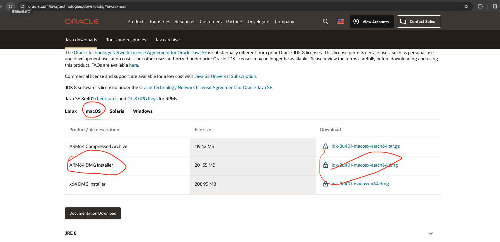
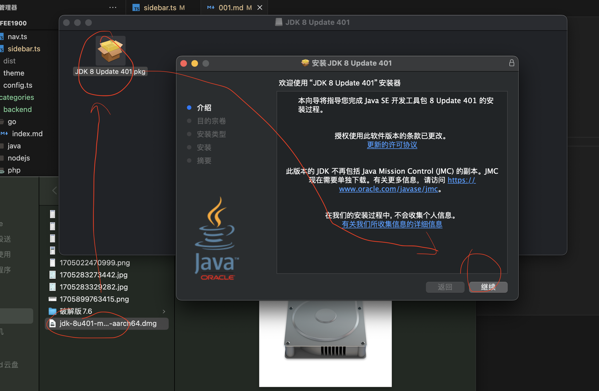

# JDK安装

## 下载地址

https://www.oracle.com/java/technologies/downloads/#java8-mac

::: tip
进入页面后，往下滑动页面，下载JDK8版本

:::




##  安装，傻瓜式安装即可



```bash
# 安装位置
/Library/Java/JavaVirtualMachines/

# 注意需要配置下PATH路径和CLASSPATH路径，~/.zshrc
export JAVA_HOME=/Library/Java/JavaVirtualMachines/jdk-1.8.jdk/Contents/Home
export PATH=$JAVA_HOME/bin:$PATH
export CLASSPATH=$JAVA_HOME/lib/tool.jar:$JAVA_HOME/lib/dt.jar

```


## 查看版本

```bash
java -version

javac -version

```

## 配置多JDK，编辑~/.zshrc文件

```bash
vim ~/.zshrc

```

```bash
# JDK
JAVA_HOME_8=/Library/Java/JavaVirtualMachines/jdk-1.8.jdk/Contents/Home
JAVA_HOME_17=/Library/Java/JavaVirtualMachines/jdk-17.jdk/Contents/Home
JAVA_HOME_21=/Library/Java/JavaVirtualMachines/jdk-21.jdk/Contents/Home

# JDK默认版本
export JAVA_HOME=$JAVA_HOME_8

# 设置PATH和CLASSPATH路径
export PATH=$JAVA_HOME/bin:$PATH
export CLASSPATH=$JAVA_HOME/lib/tool.jar:$JAVA_HOME/lib/dt.jar


```

```bash
# 刷新文件缓存
source ~/.zshrc

# 查看版本
javac -version

```