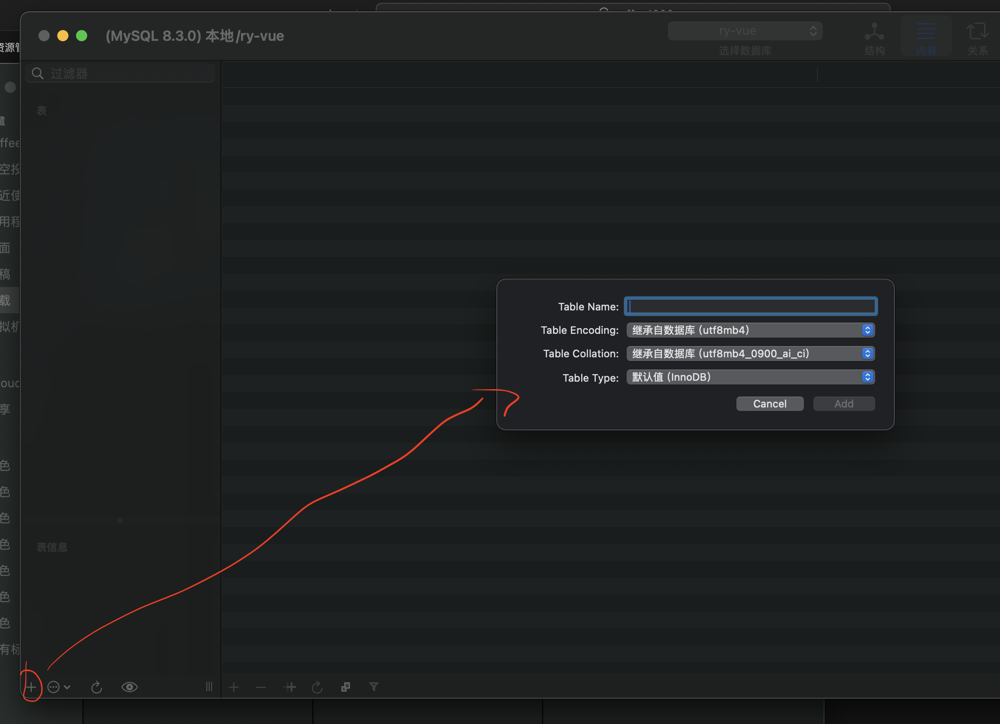

# Mysql安装

## 下载地址

https://dev.mysql.com/downloads/mysql/

## 安装，傻瓜式安装即可

::: tip
一路下一步，只有2点要注意

1，设置密码

2，更换安装目录
:::

安装完成后，会在设置的侧边栏中显示，如下


```bash
# 上图可以看出，mysql已经启动，终端执行如下命令
mysql -u root -p

# 输入密码，进入mysql交互系统
********

# 查看数据库列表
show databases;

# 选择数据库
use 数据库名;

# 查看当前数据库的数据表列表
show tables;

```

## 可视化软件，我选择`sequel ace`

`app store` 搜索 `sequel ace`


## `sequel ace` 使用

### 打开后如下所示


### 新建连接
输入信息后，先测试，在收藏，最后连接


### 新建数据库


### 选择数据库


### 新建表




# MySQL安装方式二

```bash

# 安装mysql
brew install mysql

# 查看安装的服务
brew services
brew services list

# 启动mysql
brew services start mysql

```