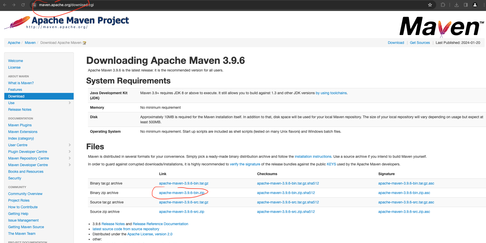
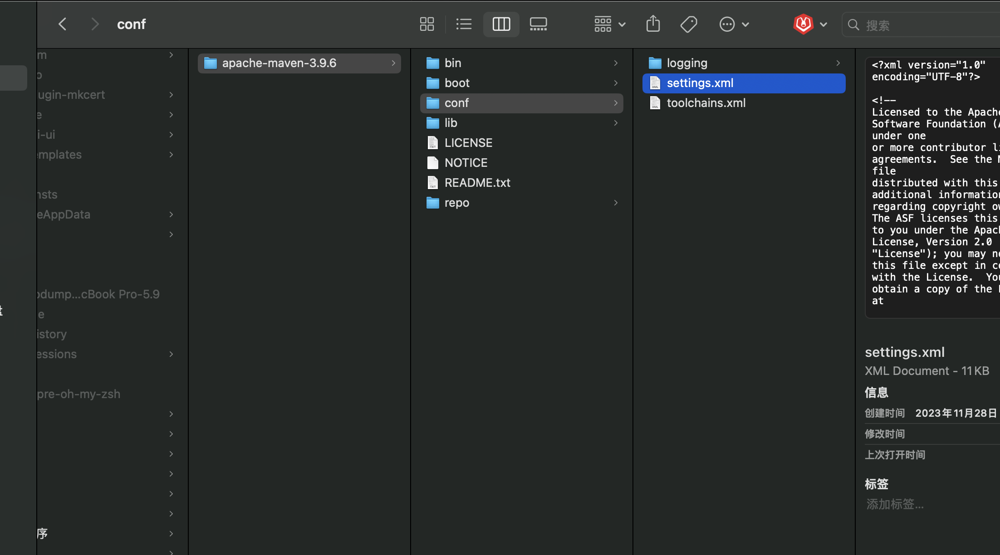

# Maven安装

## 下载地址

官网: https://maven.apache.org/

下载地址: https://maven.apache.org/download.cgi



## 解压、配置

### 移动文件路径
解压后，把解压得到的文件放到用户目录下的maven目录下

### 配置

::: tip
需要修改的所有配置都在 `settings.xml` 文件中

共需要修改2个配置项

1，修改 `localRepository` 配置项

2，配置镜像源

:::



#### 修改 `localRepository` 配置项


在 `settings.xml` 文件中搜索 `localRepository`

把 `maven` 的`绝对路径/repo`放到 `localRepository` 中间，如下

```bash
<localRepository>/Users/coffee/maven/apache-maven-3.9.6/repo</localRepository>

```
::: tip
注意，上面需要再 `maven` 安装目录下，创建 `repo` 目录

:::

#### 修改镜像源 `mirrors`

```bash
<mirror>
    <id>alimaven</id>
    <name>aliyun maven</name>
    <mirrorOf>central</mirrorOf>
    <url>http://maven.aliyun.com/nexus/content/groups/public/</url>
</mirror>
```

## 写入 `~/.zshrc` 文件

```bash
# maven
export MAVEN_HOME=/Users/coffee/maven/apache-maven-3.9.6
export PATH=$MAVEN_HOME/bin:$PATH

```
## 查看 `maven` 版本

```bash
# 刷新重载
source ~/.zshrc

# 查看版本
mvn -v

```