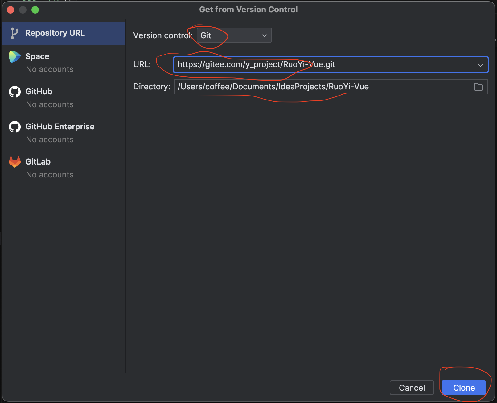
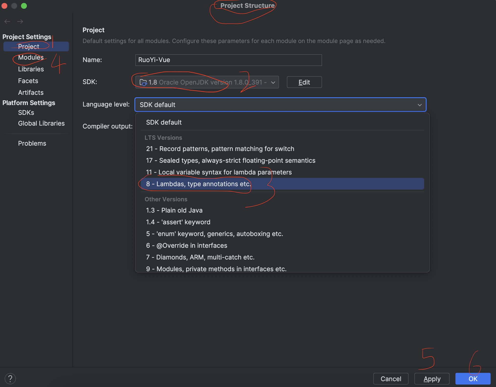

# 若依代码下载

## 打开IDEA开发者工具


## 克隆仓库
若依仓库地址: https://gitee.com/y_project/RuoYi-Vue.git



## 启动后端服务前的配置

### 配置项目JDK版本




### 配置maven


### 配置数据库信息

#### 创建数据库

使用 `sequel ace` 创建数据库，数据库名: `ry-vue`

选择数据库 `ry-vue`

#### 导入数据表

将克隆下来的若依代码中的sql文件进行导入

先导入 `ry_20231130.sql`

再导入 `quartz.sql`

#### 把数据库信息配置到若依项目中


### 配置上传路径


### 配置日志路径


### 配置redis信息


## 启动后端服务


访问: http://localhost:8080/

## 启动前端项目

```bash
cd ~/Documents/IdeaProjects/RuoYi-Vue/ruoyi-ui

npm i

npm run dev

# 登录后台
账号: admin
密码: admin123
```