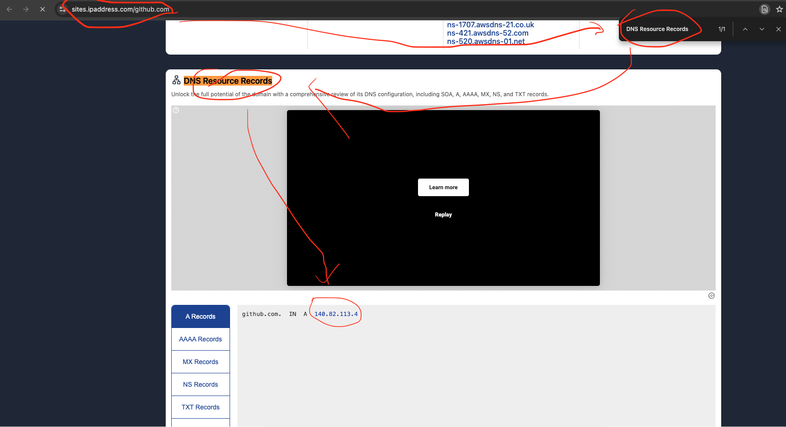
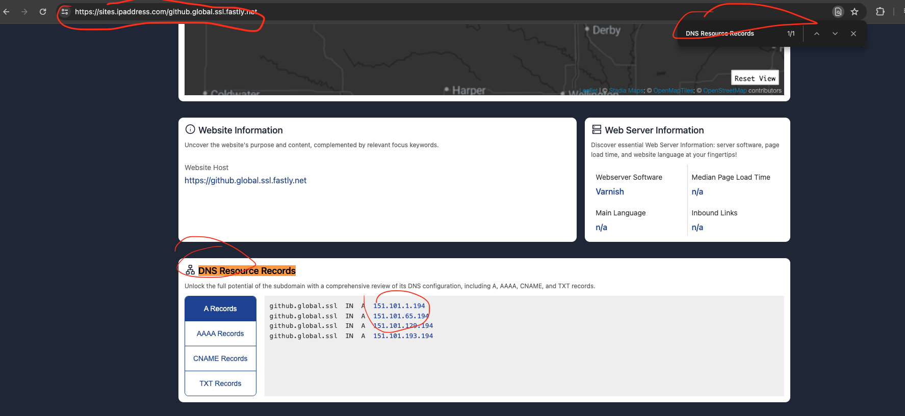
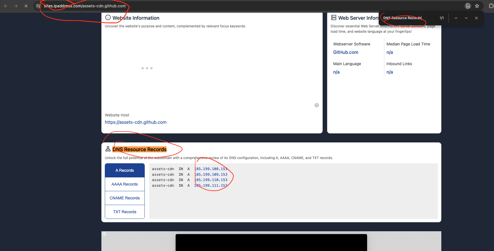

# github访问失败的解决方案

依次访问下面3个地址，`CTRL + F` 搜索 `DNS Resource Records`

- https://sites.ipaddress.com/github.com
- https://sites.ipaddress.com/github.global.ssl.fastly.net
- https://sites.ipaddress.com/assets-cdn.github.com








把下方内容写入到 `/etc/hosts` 文件中

```bash
# github.com 对应的IP
140.82.113.4 github.com

# github.global.ssl.fastly.net 对应的IP
151.101.1.194 github.global.ssl.fastly.net
151.101.65.194 github.global.ssl.fastly.net
151.101.129.194 github.global.ssl.fastly.net
151.101.193.194 github.global.ssl.fastly.net

# assets-cdn.github.com 对应的IP
185.199.108.153 assets-cdn.github.com
185.199.109.153 assets-cdn.github.com
185.199.110.153 assets-cdn.github.com
185.199.111.153 assets-cdn.github.com

```