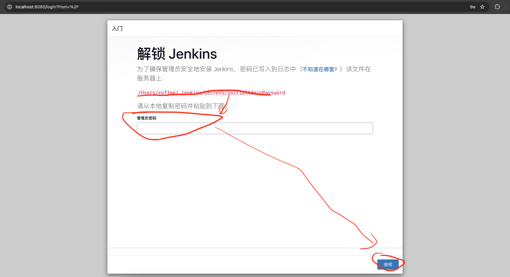
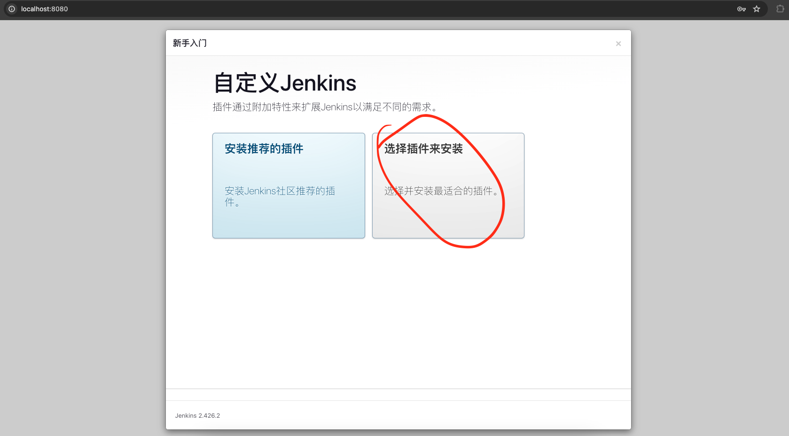
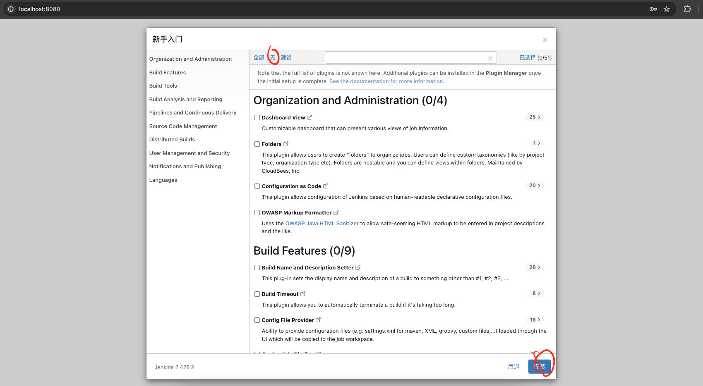
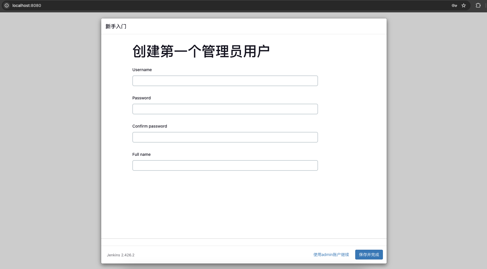
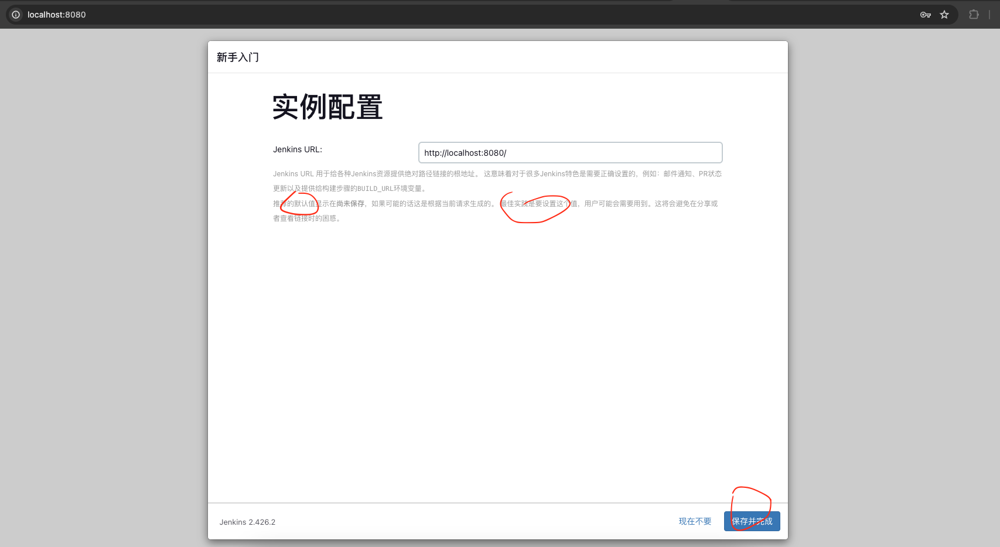
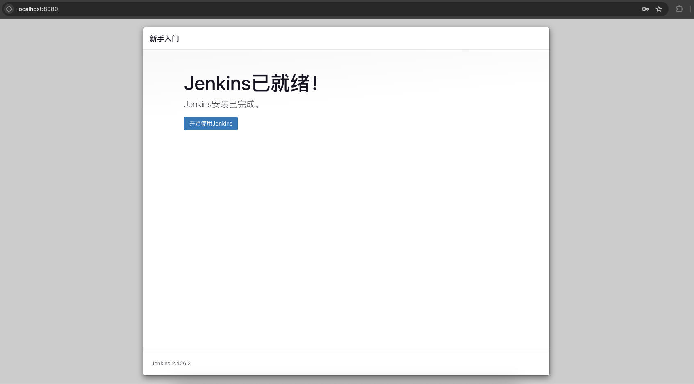
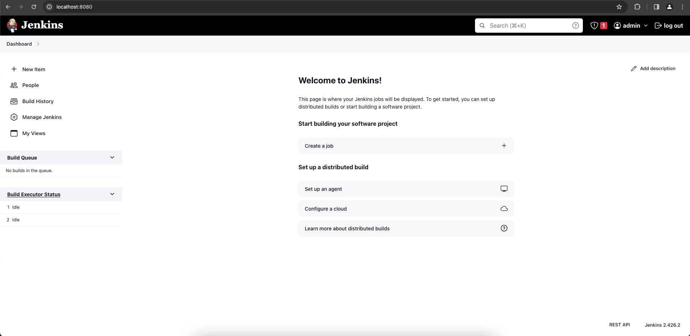
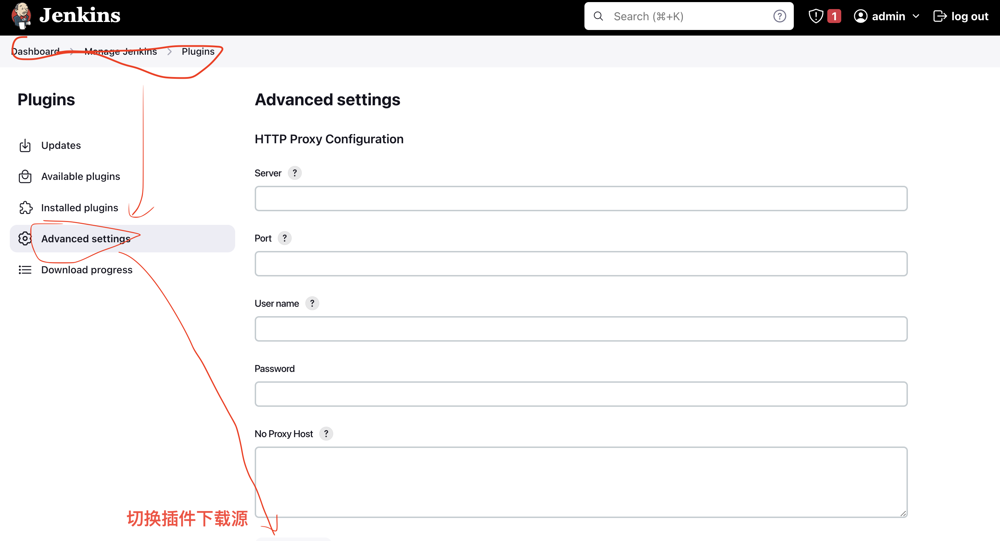
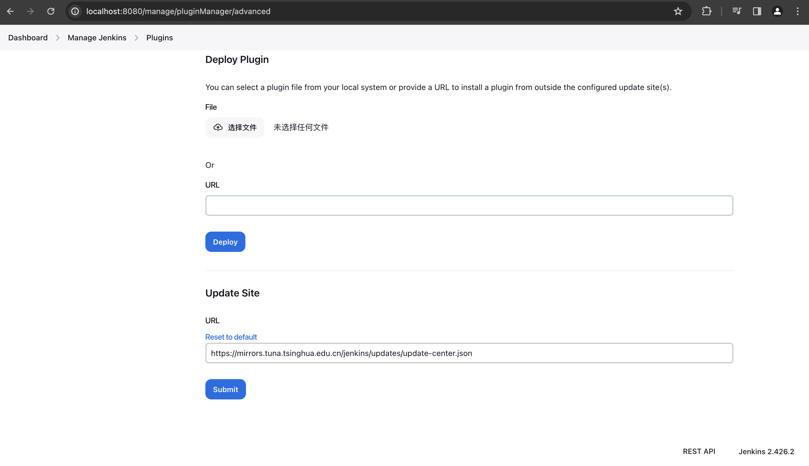
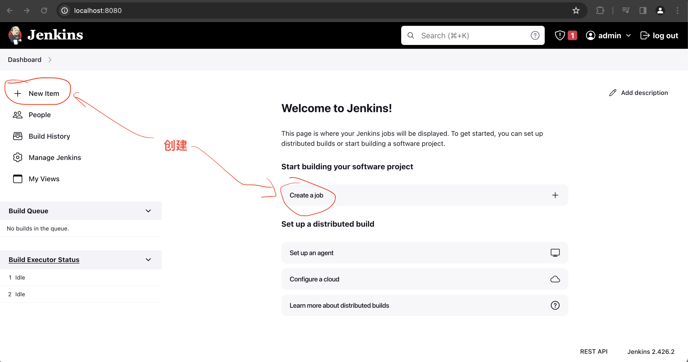

# 安装

- https://www.jenkins.io/zh/download/
- https://www.jenkins.io/download/lts/macos/

Sample commands:
- Install the latest LTS version: `brew install jenkins-lts`
- Start the Jenkins service: `brew services start jenkins-lts`
- Restart the Jenkins service: `brew services restart jenkins-lts`
- Update the Jenkins version: `brew upgrade jenkins-lts`

## 安装

```bash
$ brew install jenkins-lts

```

## 启动 & 配置

```bash
brew services start jenkins-lts

```

启动成功后，在浏览器输入`http://localhost:8080`，如下



按照上图提示，找到密码并键入，继续



选择`无`，点击安装，如下图所示



创建第一个管理员用户信息



保存后，进入实例配置页面（主要是配置URL），如下



保存后就配置完成了，开始使用Jenkins



## 更换插件源

- 登录后界面如下



- 更换插件源: https://mirrors.tuna.tsinghua.edu.cn/jenkins/updates/update-center.json

更换原因: `Jenkins` 插件源默认连接的是 `Jenkins` 自己的服务器，如果小伙伴们连接外网的速度不够好， 就容易出现下载插件失败的问题





将`~/.jenkins/updates/default.json`文件中的`updates.jenkins.io/download`更换为`mirrors.tuna.tsinghua.edu.cn/jenkins`
将`~/.jenkins/updates/default.json`文件中的`www.google.com`更换为`www.baidu.com`

更换完成后，重启 `Jenkins` 服务

```bash
brew services restart jenkins-lts

```

## 创建Item或Job


