# Windows 系统安装

## 下载 Windows 镜像

- 依次点击: 新建-->从Microsoft获取Windows-->继续-->选择旗舰版 & 中文简体-->下载

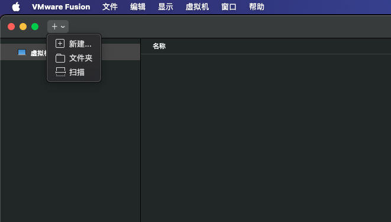


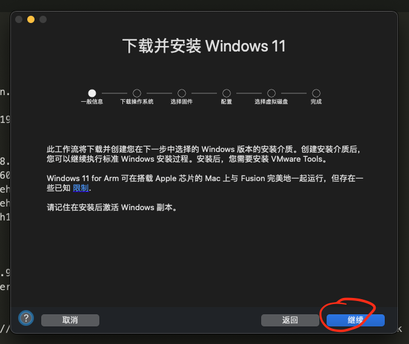

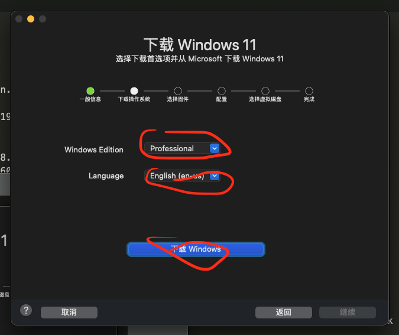

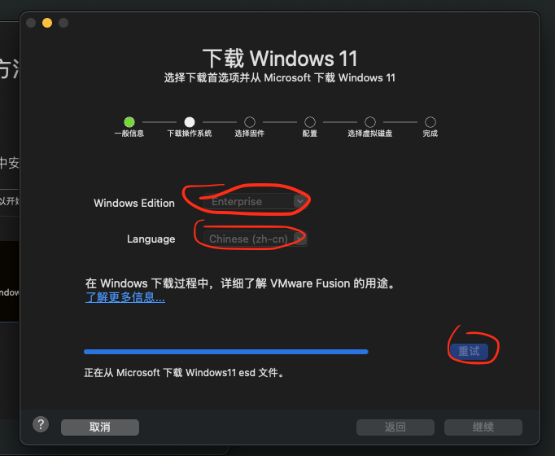

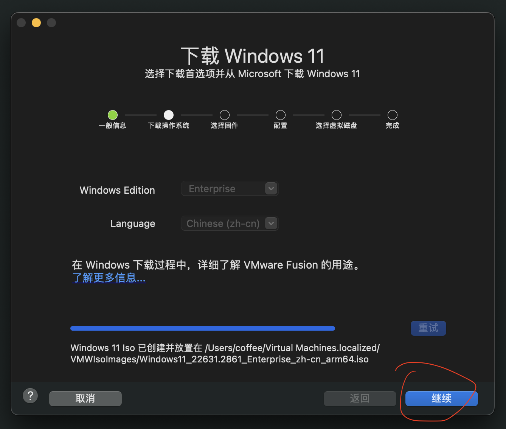

## 继续创建虚拟机

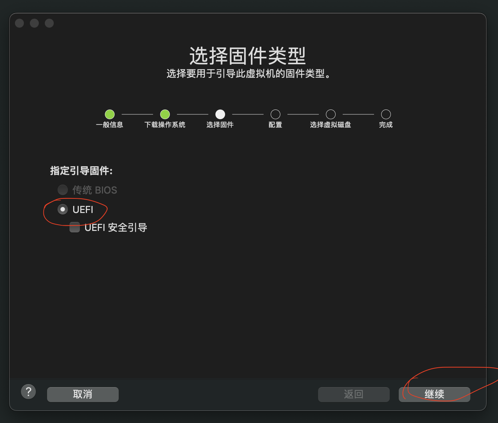

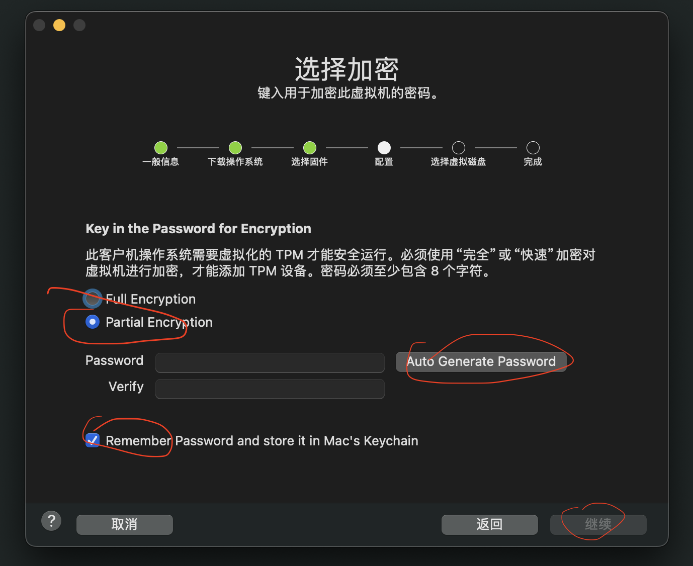

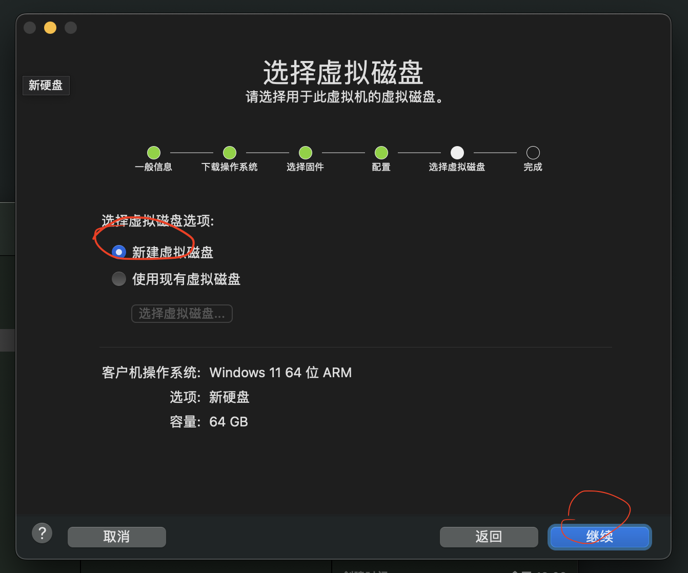

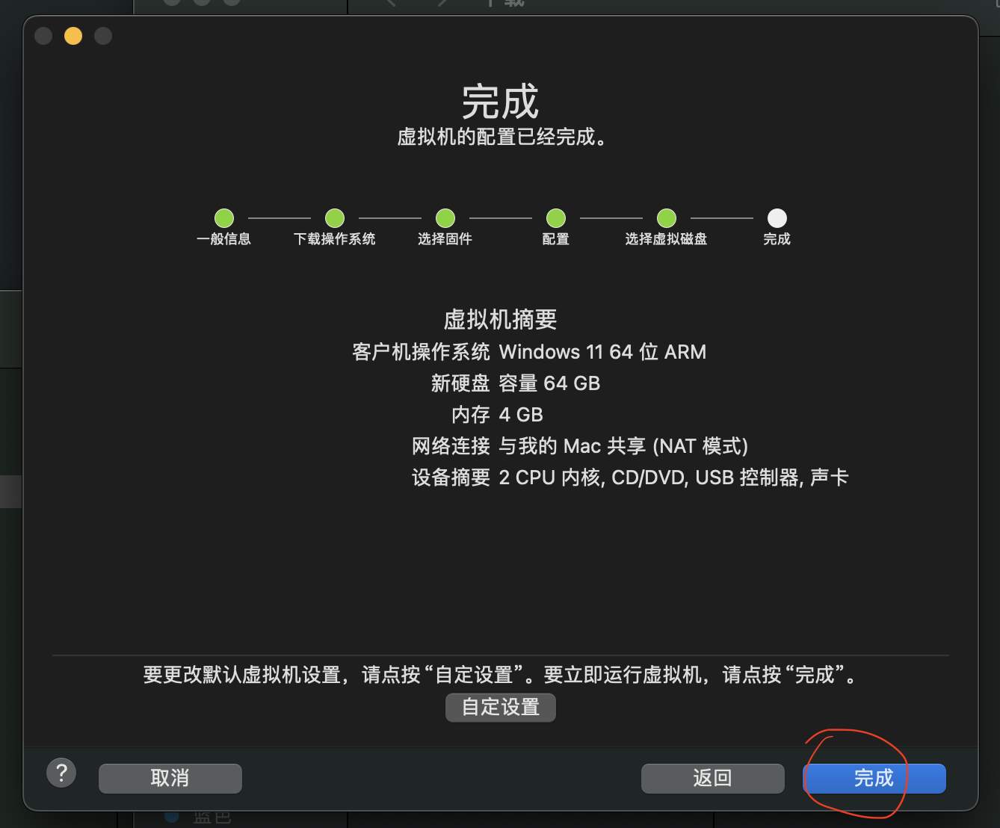

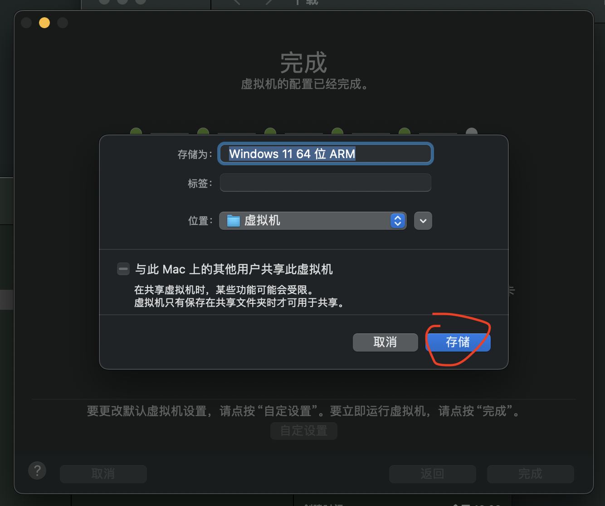


## 启动虚拟机，安装 Windows 系统

::: tip
这里启动后要立即点击键盘，才会进入
:::

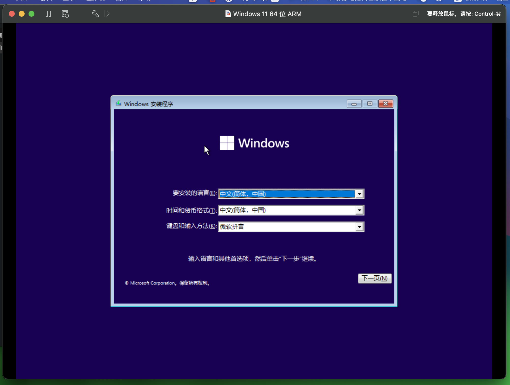

傻瓜式安装...

## 安装 VMware Tools

安装后会自动重启

## 配置开发环境

### NodeJS 环境

安装 nvm-windows

https://github.com/coreybutler/nvm-windows

安装完成后

```bash
nvm list

nvm install 20

nvm use 20.*.*

node -v

npm -v

npm i -g pnpm

pnpm -v

npm i -g yarn

yarn -v

```

### JDK

- 下载地址

https://www.oracle.com/java/technologies/downloads/#java8-windows

- 下载后，安装

傻瓜式安装，唯一需要注意的是: 修改安装目录

- 安装完成后需要: 配置环境变量

新建系统变量: JAVA_HOME === JDK目录路径

新建系统变量: CLASSPATH === JDK目录路径/lib

修改Path变量: 新增: JDK目录路径/bin

- CMD执行以下命令，校验是否安装并配置成功

```bash
java

javac

```

### Git

- 下载地址:

https://git-scm.com/download/win

- 下载后，安装

傻瓜式安装，一路下一步即可

- CMD输入git命令，校验

```bash
git

```

### Jenkins

::: tip
前置条件: 需要JAVA运行环境，JDK/JRE
:::

- [下载 Jenkins](http://mirrors.jenkins.io/war-stable/latest/jenkins.war)
- 打开终端进入到下载目录
- 运行命令 `java -jar jenkins.war --httpPort=8080`
- 打开浏览器进入链接 http://localhost:8080
- 按照说明完成安装

#### 安装插件: `Git`、`NodeJS`

- 进入管理界面---插件管理---可安装的插件---搜索Git
- 进入管理界面---插件管理---可安装的插件---搜索NodeJS


#### 创建 `Item` / `Job`

- 创建
- 配置Git地址&登录凭证、Build脚本等